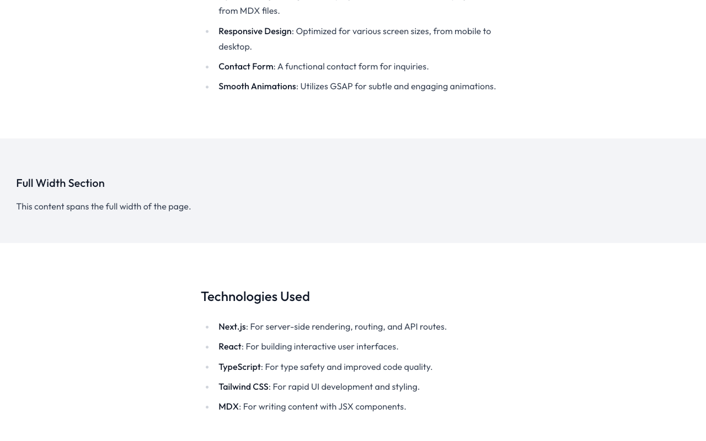
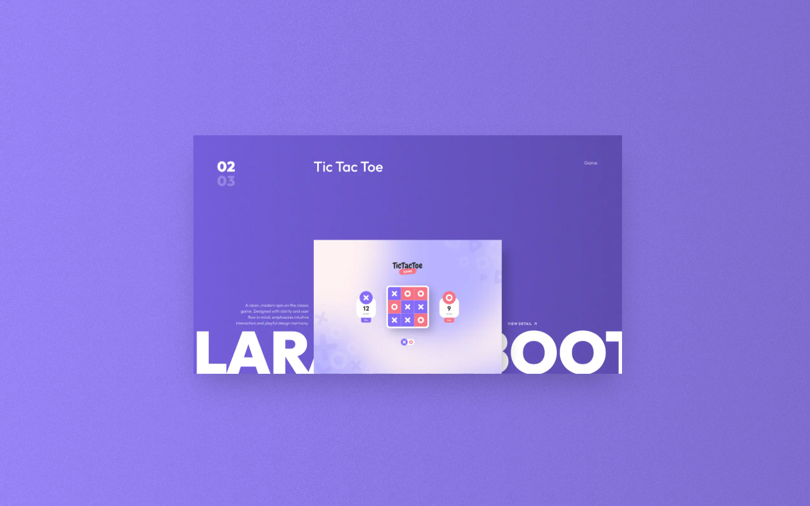

# Adding New Projects

This guide explains how to add new projects to your portfolio using the MDX format.

## Creating a New Project File

To add a new project, create a new MDX file in the `content/projects/` directory. The filename (without the `.mdx` extension) will be used as the project's slug in the URL.

For example, to create a project with the URL `/projects/my-awesome-project`, create a file named `my-awesome-project.mdx` in the `content/projects/` directory.

## Project File Structure

Each project file consists of two main parts:

1. **Frontmatter**: Metadata about the project in YAML format
2. **Content**: The project description in MDX format

### Frontmatter

The frontmatter section is enclosed in `---` at the beginning of the file:

```md
---
title: 'Project Title'
description: 'A brief description of the project'
date: '2023-01-01'
type: 'Web Application'
services: ['Web Design', 'Web Development']
role: 'Web Designer & Developer'
tags: ['Figma', 'HTML', 'CSS', 'JavaScript', 'TypeScript', 'Tailwind CSS', 'React', 'Next.js']
url: 'https://project-url.com/'
image:
  src: '/media/project-name/featured.png'
  width: 1440
  height: 1024
color: '#9c87ff'
featured: true
---
```

Here's a detailed explanation of each field:

- `title`: The project title (required)
- `description`: A brief description of the project (required)
- `date`: The project date in YYYY-MM-DD format (required for sorting)
- `type`: The type of project (e.g., Web Application, Mobile App, Design System)
- `services`: An array of services provided for the project
- `role`: Your role in the project
- `tags`: An array of tags for categorizing the project
- `url`: URL to the live project (optional)
- `image`: Featured image information
    - `src`: Path to the image file
    - `width`: Width of the image in pixels
    - `height`: Height of the image in pixels
- `color`: Accent color for the project (used as background color)
- `featured`: Whether the project should be featured on the home page (true/false)

### Content

After the frontmatter, you can write the project description in MDX format. MDX allows you to mix Markdown with React components.

Example content:

```mdx
## Project Overview

This project is a web application built with Next.js and Tailwind CSS.

## Key Features

- **Responsive Design**: Works on all device sizes
- **Dark Mode**: Automatic dark mode based on system preferences
- **Performance Optimized**: Optimized for speed and SEO

## Technologies Used

- **Next.js**: React framework for production
- **Tailwind CSS**: Utility-first CSS framework
- **TypeScript**: Typed JavaScript

## Challenges and Solutions

One of the main challenges was implementing the dark mode toggle. I solved this by using React context and localStorage to persist the user's preference.

## Live Demo

You can view the live demo at [https://project-url.com/](https://project-url.com/)

## Source Code

The source code is available on GitHub: [https://github.com/username/project-name](https://github.com/username/project-name)
```

## Adding Project Media

To add images and other media for your project:

1. Create a new directory in `public/media/` with the same name as your project slug
2. Place your images in this directory
3. Reference them in your MDX content using relative paths

For example, if your project slug is `my-awesome-project`:

```
public/
└── media/
    └── my-awesome-project/
        ├── featured.png
        ├── screenshot-1.png
        └── screenshot-2.png
```

In your MDX file, you can reference these images:

```mdx

```

## Using Custom MDX Components

The template includes several custom MDX components that you can use in your project descriptions:

### FullWidth

For full-width content sections:

```mdx
<FullWidth>
  <div className="bg-gray-100 p-8">
    <h3>Full Width Section</h3>
    <p>This content spans the full width of the page.</p>
  </div>
</FullWidth>
```



### ImgBox

For displaying images with captions, best used inside a FullWidth component:

```mdx
<FullWidth>
  <ImgBox
    src="/media/fahri-2025/project.png"
    alt="Project item"
    color="#9c87ff"
    imgProps={{ width: 672, height: 373 }}
  />
</FullWidth>
```




### Links

Custom link component for external links:

```mdx
Check out the [project website](https://project-url.com/).
```
