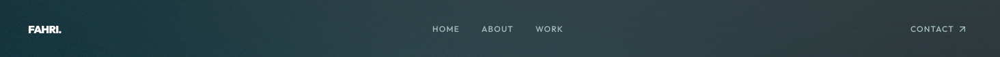
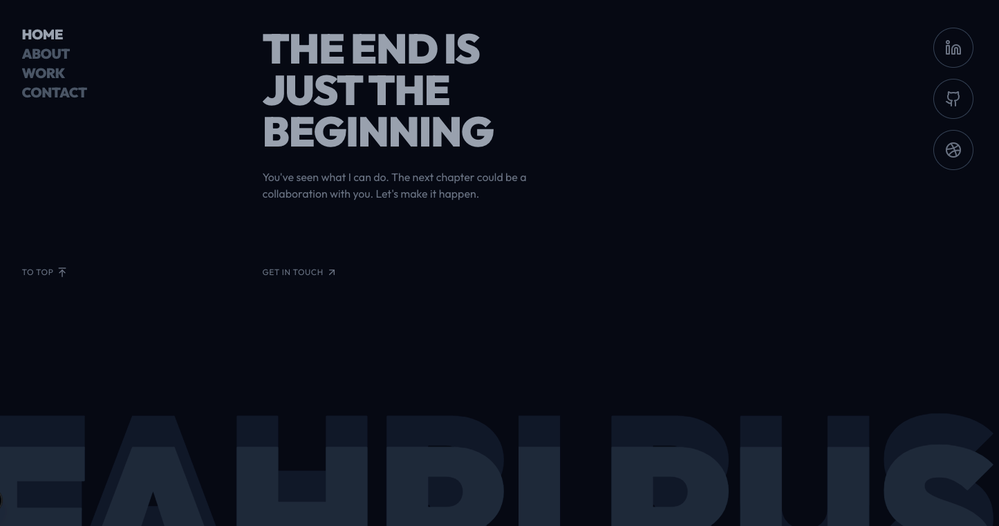
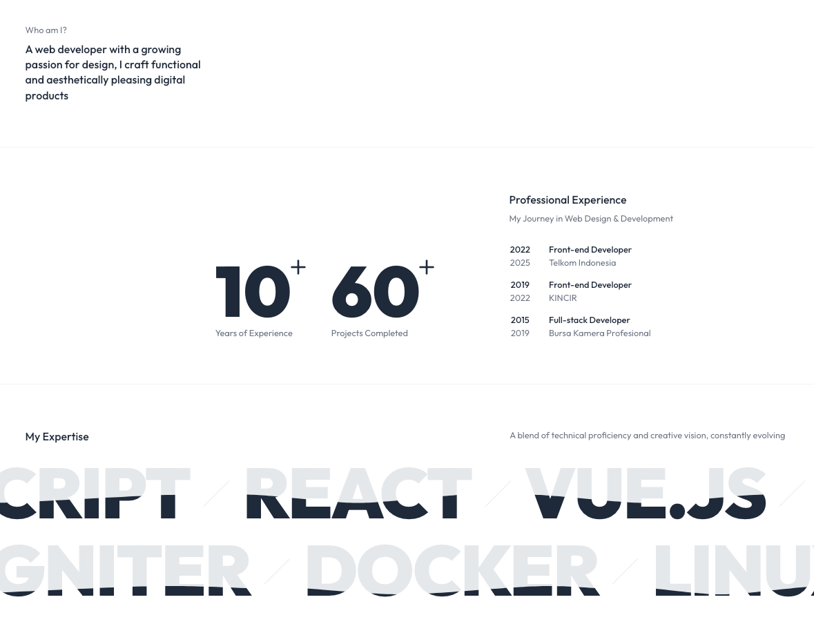

# Content Customization

This guide explains how to customize the content of your portfolio template, including personal information, site configuration, and project descriptions.

## Site Configuration

The main site configuration is located in `src/config/site.ts`. This file contains metadata about your site that is used throughout the application.

```typescript
export const siteConfig = {
  name: 'Your Name',
  description: 'Your professional description or tagline',
};
```

## Personal Information Components

Personal information is displayed in several components throughout the site:

### Header

- Update navigation links in `src/components/layout/header.tsx`.
- Update the logo in `src/assets/svg/logo.svg`
- Or modify to use text in `src/components/layout/header.tsx`. Example:

```tsx
<TransitionLink href="/">
  {/* <Logo className="h-6 w-6" /> */}
  <span className="text-base font-black leading-none tracking-tighter text-white">Fahri.</span>
</TransitionLink>
```


### Footer

- Update footer text in `src/components/layout/footer.tsx`.
- Update navigation links in `src/components/layout/footer-menu.tsx`.
- Update social links in `src/components/layout/footer-social-links.tsx`.
- Update your name in `src/components/layout/footer-name.tsx`.



### About Section



- Update the bio text in `src/app/(main)/(home)/components/about.tsx`
- Update experience in `src/app/(main)/(home)/components/about-experience.tsx`
- Update skills in `src/app/(main)/(home)/components/about-skills.tsx`

## Project Content

Projects are stored as MDX files in the `content/projects/` directory. Each project file contains frontmatter metadata and MDX content.

### Project Frontmatter

Each project file starts with frontmatter metadata enclosed in `---`:

```md
---
title: 'Project Title'
description: 'A brief description of the project'
date: '2023-01-01'
type: 'Web Application'
services: ['Web Design', 'Web Development']
role: 'Web Designer & Developer'
tags: ['Figma', 'HTML', 'CSS', 'JavaScript', 'TypeScript', 'Tailwind CSS', 'React', 'Next.js']
url: 'https://project-url.com/'
image:
  src: '/media/project-name/featured.png'
  width: 1440
  height: 1024
color: '#9c87ff'
featured: true
---
```

Here's what each field means:

- `title`: The project title
- `description`: A brief description of the project
- `date`: The project date (used for sorting)
- `type`: The type of project (e.g., Web Application, Mobile App)
- `services`: Services provided for the project
- `role`: Your role in the project
- `tags`: Tags for categorizing the project
- `url`: URL to the live project
- `image`: Featured image information
- `color`: Accent color for the project
- `featured`: Whether the project should be featured on the home page

### Project MDX Content

After the frontmatter, you can write the project description in MDX format. MDX allows you to use React components within Markdown.

Example project content:

```mdx
## Project Overview

This project is a classic Tic-Tac-Toe game. It features a 3x3 grid where players can compete against an AI bot.

## Key Features

- **AI Opponent:** Play against a bot.

## Technologies Used

- **Next.js:** A React framework for production.
- **Figma:** For UI/UX design.

## Live Demo & Design

- **Play the game:** [https://tic-tac-toe.fahri.my.id/](https://tic-tac-toe.fahri.my.id/)
- **View design on Dribbble:** [https://dribbble.com/shots/26272253-Tic-Tac-Toe](https://dribbble.com/shots/26272253-Tic-Tac-Toe)

## Source Code

The full source code is available on GitHub: [https://github.com/fahrirusliyadi/tic-tac-toe](https://github.com/fahrirusliyadi/tic-tac-toe)
```

### Custom MDX Components

The template includes several custom MDX components that you can use in your project descriptions:

- `<ImgBox>`: For displaying images with captions
- `<FullWidth>`: For full-width content sections
- `<a>`: Custom link component with underline animation

Example usage:

```mdx
<ImgBox src="/media/project-name/screenshot.png" alt="Project screenshot" caption="Project screenshot" />

<FullWidth>
  <div className="bg-gray-100 p-8 rounded-lg">
    <h3>Full Width Section</h3>
    <p>This content spans the full width of the page.</p>
  </div>
</FullWidth>
```

## Adding Media

To add media for your projects:

1. Place images in the `public/media/project-name/` directory
2. Reference them in your MDX files using relative paths: `/media/project-name/image.png`
3. For featured images, ensure they follow the naming convention and size requirements

## Updating the Contact Form

The contact form configuration is in `src/config/email.ts`:

```typescript
export const emailConfig = {
  from: 'your-email@example.com',
  to: 'recipient@example.com',
};
```

Update these values to use your own email addresses.

You can also customize the contact form fields and validation in `src/components/layout/contact-form.tsx`.