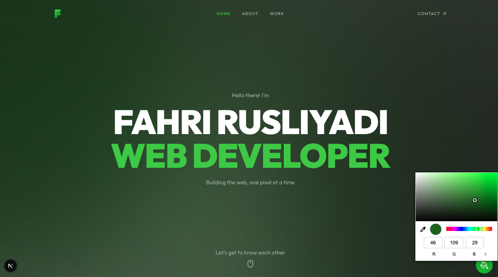
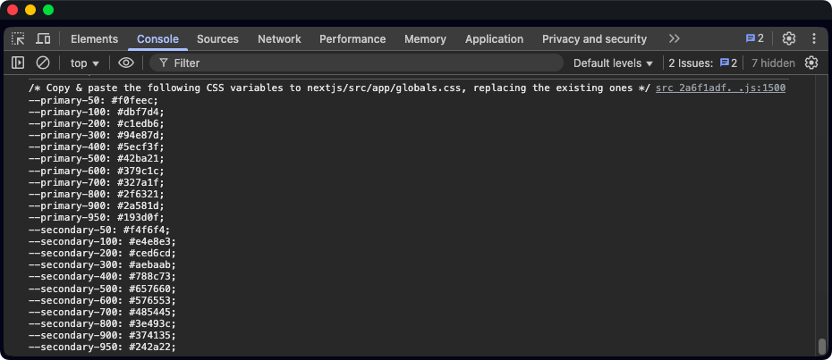

# Styling and Theme Customization

This guide explains how to customize the styling and theme of your portfolio.

## Global Styles

Global styles are defined in `src/app/globals.css`. This file contains:

1. Tailwind CSS directives
2. Custom CSS variables
3. Global utility classes

To customize global styles:

1. Add custom CSS variables to the `:root` selector
2. Modify existing variables to change color schemes
3. Add new global utility classes

### Customizing Colors

1. Open the template in the browser
2. On the right bottom corner, click on the customizer button
3. Change the colors as desired
4. Open browser console, you'll see the CSS variables
5. Copy and paste the variables to `src/app/globals.css` replacing the existing ones




### Removing the Customizer Component

The Customizer component is a development tool that allows you to easily change the color scheme of your portfolio. For production use, you should remove this component as it's not needed for end users.

To remove the Customizer component:

1. Open `src/app/(main)/layout.tsx`
2. Remove the import statement for the Customizer component:
   ```diff
   - import Customizer from '@/components/ui/customizer';
   ```

3. Remove the Customizer component from the JSX:
   ```diff
   - <Customizer />
   ```

4. Optionally, you can also remove the Customizer component file entirely:
   ```bash
   rm src/components/ui/customizer.tsx
   ```

### Customizing Fonts

Next.js provides `next/font` to automatically optimize your fonts, including Google Fonts and custom fonts, and remove the need for external network requests.

To use `next/font`:

1.  **Import the font**: Import the desired font from `next/font/google` in your `src/app/(main)/layout.tsx` file.

    ```typescript
    import { Inter } from 'next/font/google';
    ```

2.  **Define the font variable**: Create a variable for the font, specifying subsets, weights, and a CSS variable name.

    ```typescript
    const inter = Inter({
      subsets: ['latin'],
      weight: ['400', '500', '900'],
      variable: '--font-inter',
    });
    ```

3.  **Apply the font to the `body` tag**: Add the font variable to the `className` of your `body` tag in `src/app/(main)/layout.tsx`.

    ```typescript
    import { cn } from '@/lib/utils';

    <body className={cn('font-sans antialiased', inter.variable)}>
      {children}
    </body>
    ```

4.  **Use the font in Tailwind CSS**: Reference the CSS variable in `src/app/globals.css` to use the font in your Tailwind CSS classes.

    ```css
  @theme inline {
    --font-sans: var(--font-inter);
  }
  ```

## Responsive Design

The template is fully responsive using Tailwind CSS responsive utilities. The breakpoints are:

- `sm`: 640px
- `md`: 768px
- `lg`: 1024px
- `xl`: 1280px
- `2xl`: 1536px

To customize responsive behavior:

1. Use responsive prefixes in Tailwind CSS classes:
   ```jsx
   <div className="text-sm md:text-base lg:text-lg">
     Responsive text size
   </div>
   ```

2. Add custom breakpoints in `tailwind.config.ts`:
   ```typescript
   theme: {
     screens: {
       'tablet': '640px',
       'laptop': '1024px',
       'desktop': '1280px',
     },
   },
   ```

## Custom Animations

The template uses GSAP for animations. Custom animations are defined in:

1. `src/lib/gsap.ts`: GSAP utility functions
2. Component-specific animation files

To add custom animations:

1. Create animation functions in `src/lib/gsap.ts` or in component files
2. Use GSAP methods like `gsap.from()`, `gsap.to()`, etc.
3. Trigger animations with React hooks like `useGSAP`

Example of a custom animation:

```tsx
import { useRef } from 'react';
import gsap from 'gsap';
import { useGSAP } from '@gsap/react';

const MyComponent = () => {
  const container = useRef();

  useGSAP(() => {
    gsap.from('.my-element', {
      opacity: 0,
      y: 20,
      duration: 0.5,
      delay: 0.2,
    });
  }, { scope: container });

  return (
    <div ref={container}>
      <span className="my-element">Animated element</span>
    </div>
  );
};
```
